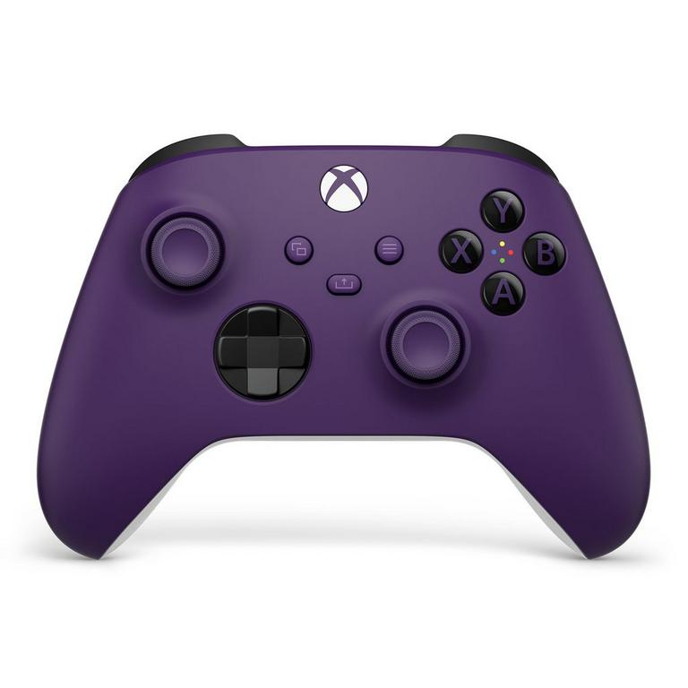
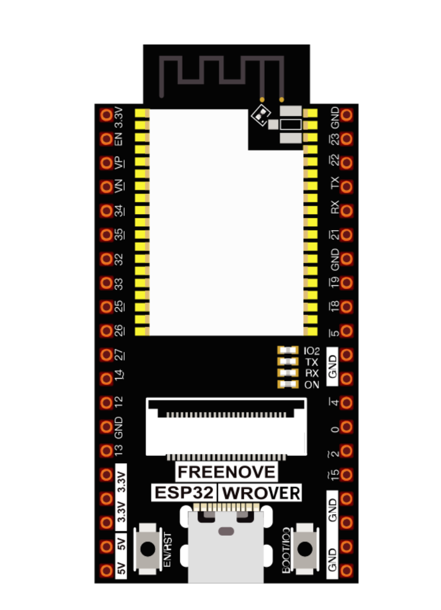
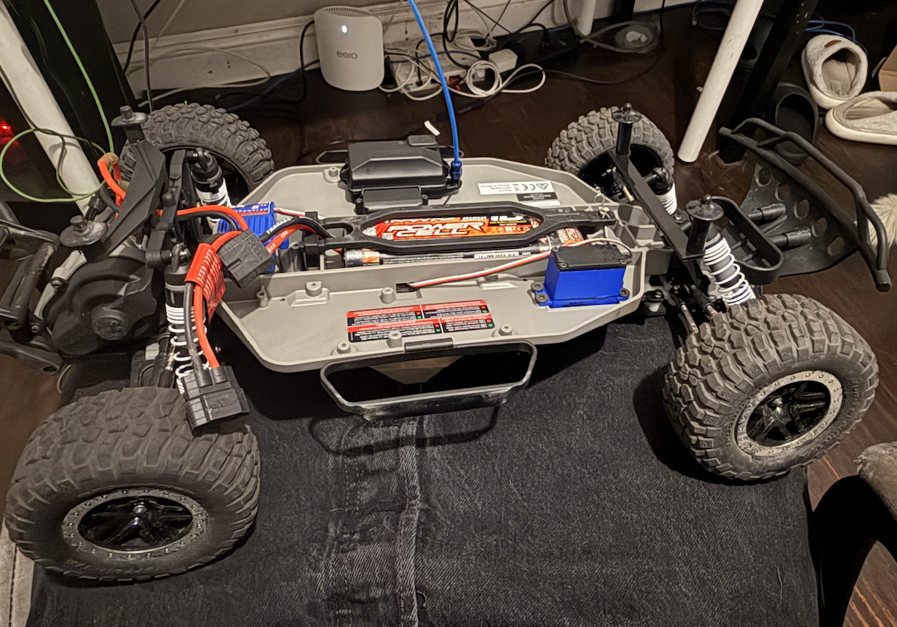

# AUTONOMOUS RC CAR W/ XBOX or PS5 CONTROLLER ON ESP32

## Goals

* Replace Transmitter/Receiver with ESP32 and XBOX controller using Bluepad32 Library
* Use RasperryPi 4 and LiDAR camera for vision mapping and path planning
* Create a React WebApp to remotely connect to the RC car for anyone globablly to use (Europe, Asia, etc.)

### SubGoals

1. Understand integration of Different systems Before relying on freeRTOS
2. Implement and use ROS for visual mapping/algorithms 
3. Create an entire Embedded System from Scratch. 
4. Implement a CI/CD workflow environment. 
5. Further understand Embedded C++/C practices. 
6. Turn this from wheels to VTOL system, have this be the foundation for my next project.
7. **BIG ONE**: Timers, Interrupts, Schedulers, Field Types and Widths, User Defined Data Structs, Algorithm efficiency (Big O Notation), non-blocking Timing, memory allocation, dynamic memory allocation, function/variable life, pointers, polymorphism, network/communication protocols (radio signals/bluetooth), Pulse Width Modulation, Pulse Width length Encoding Data, overall building systems in C and C++ 

## Video Links

* [Xbox controller controlling Servo and ESC inputs](https://youtube.com). Youtube for now. 
* [First Drive Outside With Xbox Controller](https://youtube.com). Youtube for Now.
* [Manual Mode Hardware Being Used](https://youtube.com). Youtube For Now.
* [Manual Mode Code Walk Through](https://youtube.com). Youtube For Now.
* [Autonomous Mode](https://youtube.com). Youtube For Now.
* [Autonomous Mode Hardware Being Used](https://youtube.com). Youtube For Now.
* [Autonomous Mode Code Walk Through and Frameworks](https://youtube.com). Youtube For Now. 

## How To Implement Yourself

1. 'git clone ' this repo. 
2. Open Arduino IDE
    1. Install Bluepad32 Library
    2. Install esp32 boards
    3. under tools, select appropriate esp32 board (or your boad of choice)
    4. Select upload speed that matches baud speed in Serial initialization (115200)
    5. Select appropriate Port that you connect to you PC
    6. Double check all libraries included are installed on arduino IDE
3. Check Hardware connected properly
    1. You Should have enough understanding of how you are powering your microcontroller of choice, ESP32 in this case, motor, server and ESC. 
    2. Check ESC and Motor is powered by either LiPo battery or NiMH battery, 2 - 3 cells
    3. Server is powered by the power from ESC
    4. Ground must be shared between Servo, ESC and ESP32
4. Flash the Code to ESP32 via Arduino IDE

- **VIDEO WILL BE OUT SOON ON IMPLEMENTATION**

## Images of What I currently Use

